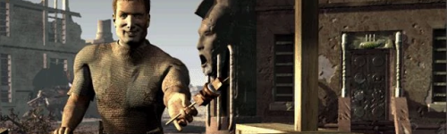

Tiny Rebalance
-----------------

This mod changes drug effects of healing and food items, to make some less strong (Stimpaks), and some more valuable (food). Also, on deat of a critter, this mod will randomly destroy half of the loot (can be adjusted in the TinyRebalance.ini file).

## Changes to drug items
**Stimpak**
* Heal 5 to 10hp from 10 to 20hp
* Heal up to 10hp over the next 2 minutes

**Super Stimpak**
* Drains -6 to -12hp from -3 to -6hp

**Fruit**
* Heal 2 to 8hp from 1 to 4hp
* +3 rads from +2

**Iguana-on-a-stick (Bits)**
* Heal 4 to 8hp
* +1 healing rate for up to 8 hours

**Iguana-on-a-stick (Whole)**
* Heal 5 to 10hp
* +2 healing rate for up to 8 hours

**Nuca Cola**
* Heal 1 to 2hp from 1hp
* +1 Perception for 30 minutes

**Beer**
* +1 Charisma for 30 mins

**Booze**
* +1 Strength for 30 mins

**Roentgen Rum**
* +1 Strength for 30 mins
* +50 Rad Resistance for 1 hour

**Rot Gut**
* +2 Strength for 30 mins
* -25 Current Poison Level over 30 minutes

**Gamma Gulp Beer**
* +1 Charisma for 30 mins

### Installation
To use this mod, open the ddraw.ini, go to [ExtraPatches] and add "PatchFile[number]=mods\TinyRebalance" at the end of the "PatchFile"-list!
The game will now load the additional mod folder.

If there is more than one additional mod, make sure to correctly number the "PatchFileX" entry (1, 2, 3, ...).
