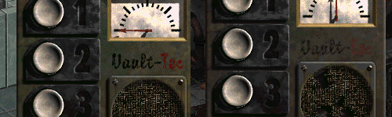

Vault-Tec Elevator Fix
----------------

This mod changes the "Vaul Tek" on the elevator interface graphic to read "Vault-Tec" for consistency with the rest of the game. 

Should work with every Fallout 1 and 2 mod.

### Installation
To use this mod, add the mod folder name to the mods_order.txt file inside the /mods/ directory. If the mods_order.txt doesn't exist, start the game once for it to be created.