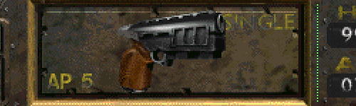

Alternative 14mm Pistol
-----------------

Inventory icon created by NovaRain. This mod changes the visuals of the 14mm Pistol to be more in line with the FNV 12.7mm Pistol, as well as increases the raw damage by +3 points to make it fit better into the pistol tier list between the Desert Eagle and .223 Pistol.

### Installation
To use this mod, open the ddraw.ini, go to [ExtraPatches] and add "PatchFile[number]=mods\alternative_14mmPistol" at the end of the "PatchFile"-list!
The game will now load the additional mod folder.

If there is more than one additional mod, make sure to correctly number the "PatchFileX" entry (1, 2, 3, ...).
