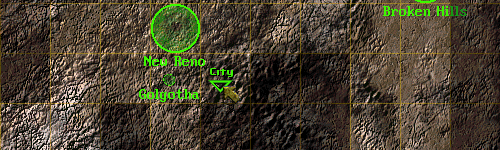

Fallout 2 Resting Encounters
------------------

In the spirit of Fallout 1's worldmap resting locations, this mod adds the same for Fallout 2. Stop in the desert -> desert map. Stop over city terrain -> city ruins map, and so on. 

This mod is compatible with Fo2 vanilla, the unofficial patch, and the restoration project - as long as the latest Sfall release is used. For a download link, see the attached file to this post.

### Installation
To use this mod, open the ddraw.ini, go to [ExtraPatches] and add "PatchFile[number]=mods\fo2_resting_encounters" at the end of the "PatchFile"-list!
The game will now load the additional mod folder.

If there is more than one additional mod, make sure to correctly number the "PatchFileX" entry (1, 2, 3, ...). 
