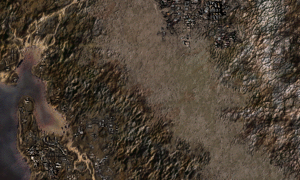

<p align="center"></p>

Fallout 2 Alternative Worldmap
------------------

The FALLOUT 2 worldmap has various terrain tiles set as "city", which are impossible to recognize for players. With this mod enabled, those tiles have actual visible city ruins on them.
I have used .Pixotes. modified worldmap as base.

Additionally, this mod also allows to enable Fo1-style resting encounters. Stop in the desert -> desert map. Stop over city terrain -> city ruins map, and so on. 

*Check out the fo2_alternative_wm.ini file for all configuration options.*

Also I suggest to set the following settings in the ddraw.ini file for a better travel experience when using this mod:

```
ExpandWorldMap=1
WorldMapTravelMarkers=1
TravelMarkerColor=134
TravelMarkerStyles=1:2,2:1,1:2,1:2
WorldMapTerrainInfo=1
```
This mod is compatible with Fo2 vanilla, the Unofficial Patch, and the Restoration Project.

### Installation
To use this mod, open the ddraw.ini, go to [ExtraPatches] and add "PatchFile[number]=mods\fo2_alternative_wm" at the end of the "PatchFile"-list!
The game will now load the additional mod folder.

If there is more than one additional mod, make sure to correctly number the "PatchFileX" entry (1, 2, 3, ...). 
