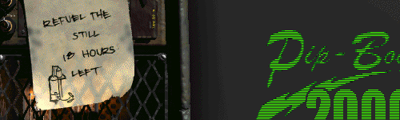

Fallout 2 Timer Notes
------------------

In the spirit of Fallout 1's water timer, this mod adds post-it notes to 3 timed quests in Fallout 2:
- Refuel the still (Klamath),
- Find Karl (Modoc),
- and the Salvatore guard assignment (New Reno).

This mod is compatible with Fo2 vanilla, the unofficial patch, and the restoration project - as long as the latest Sfall release is used. 

### Installation
To use this mod, copy the "fo2_alternative_wm.dat" folder into the "/fallout2/mods/" folder and the game will automatically load it.
