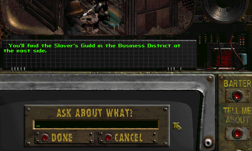

Fallout 2 Tell-Me-About's
------------------

With this mod, the FALLOUT 1 Tell-Me-About feature gets introduced into FALLOUT 2! It's configurable and can be tweaked to a varying degree. It is compatible with Fo2 vanilla, the unofficial patch, and the restoration project - as long as the latest Sfall release is used. It can also be used with any other total conversion mod, as long as someone spends the work on writing actual NPC responses.

**Note:** Currently this is more or less a modders resource. Most NPCs in the vanilla game don't have TMA lines written for them, and the configuration (and written text) in this mod is unfinished. If someone wants to help with filling it out, be my guest.

For a download link, see the attached file to this post.

### Installation
To use this mod, copy the "fo2_tma.dat" folder into the "/fallout2/mods/" folder and the game will automatically load it.
