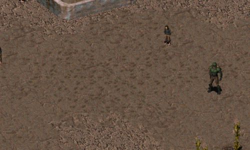

Footstep Test
-----------------

Not an actual mod to play with, just test files for footsteps in soft sand.

Only works on the player, Ian, and children critter.

### Installation
To use this mod, open the ddraw.ini, go to [ExtraPatches] and add "PatchFile[number]=mods\test_footsteps" at the end of the "PatchFile"-list!
The game will now load the additional mod folder.

If there is more than one additional mod, make sure to correctly number the "PatchFileX" entry (1, 2, 3, ...).
